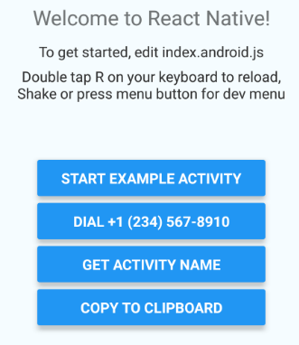

# React Native Activity Demo

## Build Status

| Android | iOS |
|---|---|
| [](https://dev.azure.com/petter0012/react-native-android-activity/_build/latest?definitionId=1&branchName=master) | [?branchName=master)](https://dev.azure.com/petter0012/react-native-android-activity/_build/latest?definitionId=2&branchName=master) |

This sample, which grew out of a [question on Stack Overflow](https://stackoverflow.com/questions/42253397/call-android-activity-from-react-native-code/43675819), demonstrates the interface between React Native JavaScript and native code &ndash; Java on Android, Objective-C on iOS.

The original version was Android-only; support for iOS was added in March 2019.

This project demonstrates the following:

* Calling from JavaScript into native modules:
  * ...using a custom native module called `ActivityStarter`:
    * Navigate from React Native to a Java activity (or iOS view controller) internal to the host app;
    * Start an external intent to dial a phone number, passing data from JavaScript;
    * Query the host app for information.
  * ...using the native module `Clipboard`, which [comes with React Native out of the box](https://github.com/facebook/react-native/blob/master/ReactAndroid/src/main/java/com/facebook/react/modules/clipboard/ClipboardModule.java):
    * Copy information to the clipboard.
* Calling a JavaScript method from Java or Objective-C, using an officially undocumented approach.
* Sending events from the native platform to JavaScript. (When possible, prefer this approach to the undocumented one.)
* Verifying that custom edit menu extensions work with React Native `TextInput`. (Android only.)
* Adding a custom menu option to React Native debug menu.

There is no technical difference between the `ActivityStarter` and `Clipboard` native modules, except one is defined in this project while the other ships as part of React Native.

The starting point for this sample is a slightly tweaked standard React Native project as generated by a long-outdated version of `react-native init`. We add six buttons to the generated page:



The `TextInput` box appears only in the Android version. Since both platforms use the same JavaScript, I took the opportunity to demonstrate how to handle platform-specific tweaks &ndash; look for `Platform.select` in [`index.js`](index.js).

## Getting started

<!-- markdownlint-disable MD031 -->

* Install [Git](https://git-scm.com/downloads).
* Install [Node.js](https://nodejs.org/en/download/).
* Install [Yarn](https://yarnpkg.com/lang/en/docs/install/#windows-stable). Use a shell with Git, Node and Yarn in the path for all commands.
* Clone this project:\
  `git clone https://github.com/petterh/react-native-android-activity.git`\
  (Alternatively, create your own fork and clone that instead.)
* `cd react-native-android-activity`
* Run `yarn` to download dependencies (or, if you wish, `npm install`)
* For Android development (using Windows, Mac or Linux), install [Android Studio](https://developer.android.com/studio/install.html) (follow instructions [on this page](https://facebook.github.io/react-native/docs/getting-started.html)).
* For iOS development (Mac only), install [Xcode](https://developer.apple.com/xcode/).
* By default, the debug build of the app loads the JS bundle from your dev box, so start a bundler:
  ```cmd
  yarn start
  ```

### Android

* Connect an Android device via USB, or use an emulator.
* [Enable USB Debugging in Developer options](https://developer.android.com/studio/run/device).
* Open the app in Android Studio and run it.
* If this fails with the message "Could not get BatchedBridge, make sure your bundle is packaged correctly", your packager is likely not running.
* If it complains about connecting to the dev server, run `adb reverse tcp:8081 tcp:8081`
* If it crashes while opening the ReactNative controls, try to modify the following phone settings:
**Android Settings -> Apps -> Settings once again (the gear) to go to Configure Apps view -> Draw over other apps -> Allow React Native Android Activity Demo to draw over other apps**. (The demo app *should* ask for this automatically, though.)
* To embed the bundle in the apk (and not have to run the packager), set `bundleInDebug=true` in `android/gradle.properties`.

### iOS

* Open the iOS project in Xcode: `open Activity.xcworkspace`.
* Run the Activity application.

<!-- markdownlint-enable MD031 -->

## The React Native side

The gist of the JavaScript code looks like this:

```javascript
import { ..., NativeModules, ... } from 'react-native';

export default class ActivityDemoComponent extends Component {
  render() {
    return (
      <View style={styles.container}>
        <Text style={styles.welcome}>
          Welcome to React Native!
        </Text>
        <Text style={styles.instructions}>
          To get started, edit index.js
        </Text>
        <!-- Menu buttons: https://facebook.github.io/react-native/docs/debugging -->
        <Text style={styles.instructions}>
          Double tap R on your keyboard to reload,{'\n'}
          Shake or press menu button for dev menu
        </Text>
        <View style={styles.buttonContainer}>
          <Button
            onPress={() => NativeModules.ActivityStarter.navigateToExample()}
            title='Start example activity'
          />
          <Button
            onPress={() => NativeModules.ActivityStarter.dialNumber('+1 (234) 567-8910')}
            title='Dial +1 (234) 567-8910'
          />
          <Button
            onPress={() => NativeModules.ActivityStarter.getName((name) => { alert(name); })}
            title='Get activity name'
          />
          <Button
            onPress={() => NativeModules.Clipboard.setString("Hello from JavaScript!")}
            title='Copy to clipboard'
          />
        </View>
      </View>
    );
  }
}
```

The first three buttons use three methods on `NativeModules.ActivityStarter`. Where does this come from?

## Android: The Java module

`ActivityStarter` is just a Java class that implements a React Native Java interface called `NativeModule`. The heavy lifting of this interface is already done by `BaseJavaModule`, so one normally extends either that one or `ReactContextBaseJavaModule`:

```java
class ActivityStarterModule extends ReactContextBaseJavaModule {

    ActivityStarterModule(ReactApplicationContext reactContext) {
        super(reactContext);
    }

    @Override
    public String getName() {
        return "ActivityStarter";
    }

    @ReactMethod
    void navigateToExample() {
        ReactApplicationContext context = getReactApplicationContext();
        Intent intent = new Intent(context, ExampleActivity.class);
        context.startActivity(intent);
    }

    @ReactMethod
    void dialNumber(@NonNull String number) {
        Intent intent = new Intent(Intent.ACTION_DIAL, Uri.parse("tel:" + number));
        getReactApplicationContext().startActivity(intent);
    }

    @ReactMethod
    void getActivityName(@NonNull Callback callback) {
        Activity activity = getCurrentActivity();
        if (activity != null) {
            callback.invoke(activity.getClass().getSimpleName());
        }
    }
}
```

The name of this class doesn't matter; the `ActivityStarter` module name exposed to JavaScript comes from the `getName()` method.

Each method annotated with a `@ReactMethod` attribute is accessible from JavaScript. Overloads are not allowed, though; you have to know the method signatures. (The out-of-the-box `Clipboard` module isn't usually accessed the way I do it here; React Native includes [`Clipboard.js`](https://github.com/facebook/react-native/blob/master/Libraries/Components/Clipboard/Clipboard.js), which [makes the thing more accessible from JavaScript](https://facebook.github.io/react-native/docs/clipboard.html) &ndash; if you're creating modules for public consumption, consider doing something similar.)

A `@ReactMethod` must be of type `void`. In the case of `getActivityName()` we want to return a string; we do this by using a callback.

## Android: Connecting the dots

The default app generated by `react-native init` contains a `MainApplication` class that initializes React Native. Among other things it extends `ReactNativeHost` to override its `getPackages` method:

```java
@Override
protected List<ReactPackage> getPackages() {
    return Arrays.<ReactPackage>asList(
            new MainReactPackage()
    );
}
```

This is the point where we hook our Java code to the React Native machinery. Create a class that implements `ReactPackage` and override `createNativeModules`:

```java
class ActivityStarterReactPackage implements ReactPackage {
    @Override
    public List<NativeModule> createNativeModules(ReactApplicationContext reactContext) {
        List<NativeModule> modules = new ArrayList<>();
        modules.add(new ActivityStarterModule(reactContext));
        return modules;
    }

    @Override
    public List<Class<? extends JavaScriptModule>> createJSModules() {
        return Collections.emptyList();
    }

    @Override
    public List<ViewManager> createViewManagers(ReactApplicationContext reactContext) {
        return Collections.emptyList();
    }
}
```

Finally, update `MainApplication` to include our new package:

```java
public class MainApplication extends Application implements ReactApplication {

    private final ReactNativeHost mReactNativeHost = new ReactNativeHost(this) {
        @Override
        public boolean getUseDeveloperSupport() {
            return BuildConfig.DEBUG;
        }

        @Override
        protected List<ReactPackage> getPackages() {
            return Arrays.<ReactPackage>asList(
                    new ActivityStarterReactPackage(), // This is it!
                    new MainReactPackage()
            );
        }
    };

    @Override
    public ReactNativeHost getReactNativeHost() {
        return mReactNativeHost;
    }

    @Override
    public void onCreate() {
        super.onCreate();
        SoLoader.init(this, false);
    }
}
```

## Android: Calling JavaScript from Java

This demo is invoked by the last button on the page:

```javascript
<Button
    onPress={() => NativeModules.ActivityStarter.callJavaScript()}
    title='Call JavaScript from Java'
/>
```

The Java side looks like this (in `ActivityStarterReactPackage` class):

```java
@ReactMethod
void callJavaScript() {
    Activity activity = getCurrentActivity();
    if (activity != null) {
        MainApplication application = (MainApplication) activity.getApplication();
        ReactNativeHost reactNativeHost = application.getReactNativeHost();
        ReactInstanceManager reactInstanceManager = reactNativeHost.getReactInstanceManager();
        ReactContext reactContext = reactInstanceManager.getCurrentReactContext();

        if (reactContext != null) {
            CatalystInstance catalystInstance = reactContext.getCatalystInstance();
            WritableNativeArray params = new WritableNativeArray();
            params.pushString("Hello, JavaScript!");
            catalystInstance.callFunction("JavaScriptVisibleToJava", "alert", params);
        }
    }
}
```

The JavaScript method we're calling is defined and made visible to Java as follows:

```javascript
import BatchedBridge from "react-native/Libraries/BatchedBridge/BatchedBridge";

export class ExposedToJava {
  alert(message) {
      alert(message);
  }
}

const exposedToJava = new ExposedToJava();
BatchedBridge.registerCallableModule("JavaScriptVisibleToJava", exposedToJava);
```

## Android: Summary

1. The main application class initializes React Native and creates a `ReactNativeHost` whose `getPackages` include our package in its list.
1. `ActivityStarterReactPackage` includes `ActivityStarterModule` in its native modules list.
1. `ActivityStarterModule` returns "ActivityStarter" from its `getName` method, and annotates three methods with the `ReactMethod` attribute.
1. JavaScript can access `ActivityStarter.getActivityName` and friends via `NativeModules`.

## iOS

The iOS Objective-C classes are parallel to the Android Java classes. There are differences:

* Modules are picked up automatically.
* There is no react application context; instead there is the react native bridge, which is initialized in the [`AppDelegate`](ios/Activity/AppDelegate.m) class.
* Events are done somewhat differently. In Android we can just grab a `DeviceEventManagerModule.RCTDeviceEventEmitter` and fire away; in iOS it is necessary to subclass `RCTEventEmitter`.

Here is a sample of an Objective-C class implementation with methods callable from JavaScript:

```obj-c
@implementation ActivityStarterModule

RCT_EXPORT_MODULE(ActivityStarter);

RCT_EXPORT_METHOD(navigateToExample)
{
  dispatch_async(dispatch_get_main_queue(), ^{
    AppDelegate *appDelegate = (AppDelegate *) [UIApplication sharedApplication].delegate;
    [appDelegate navigateToExampleView];
  });
}

RCT_EXPORT_METHOD(getActivityName:(RCTResponseSenderBlock) callback)
{
  callback(@[@"ActivityStarter (callback)"]);
}

@end
```

## iOS: Calling JavaScript from Java

This requires the react native bridge, so responsibility resides with the `AppDelegate` class, for convenience.

```obj-c
- (void) callJavaScript
{
  [self.reactBridge enqueueJSCall:@"JavaScriptVisibleToJava"
                           method:@"alert"
                             args:@[@"Hello, JavaScript!"]
                       completion:nil];
}
```

## Addendum

I just added a second version of `ActivityStarterModule.getActivityName` called `getActivityNameAsPromise`, with a corresponding button.

## Addendum 2

[I added a sample of event triggering, another way to communicate](https://github.com/petterh/react-native-android-activity/commit/e63706e2ca828d4de4db1bf7cf85fe5be28d648d). Tap **Start Example Activity**, then **Trigger event**.

## Further reading

* [Native Modules on Android](https://facebook.github.io/react-native/docs/native-modules-android.html)
* [Native Modules on iOS](https://facebook.github.io/react-native/docs/native-modules-ios)

## Issues

The various Android apps explicitly call `SoLoader.init` because of [this issue](https://github.com/facebook/react-native/issues/26342). I have a [PR to fix it](https://github.com/facebook/react-native/pull/26343). Once this is in (assuming Facebook accepts it) I'll remove them.
